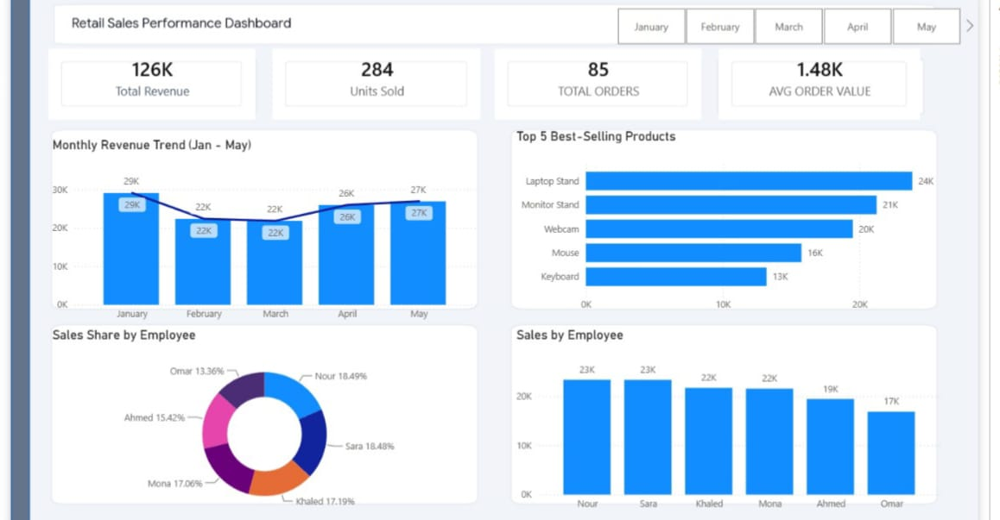

# 📊 Sales Performance Analytics Dashboard (Power BI)

An advanced Business Intelligence dashboard designed to track key sales metrics, evaluate overall performance, and deliver actionable insights for strategic decision-making.

## 📌 Project Overview
This Power BI project provides a comprehensive overview of sales operations, helping stakeholders monitor critical Key Performance Indicators (KPIs), analyze revenue trends, and track product or regional performance dynamically. 
## 🖼️ Dashboard Preview

## 🛠️ Key Features & Technical Skills
- **Data Modeling & ETL:** Cleaned and structured raw data to build a reliable relational data model.
- **Interactive DAX Measures:** Developed advanced DAX formulas for calculating totals, margins, and comparative performance.
- **Executive UI/UX Design:** Built clean, professional, and user-friendly visual layouts with interactive filtering slicers.
- **Business Problem Solving:** Transformed complex transactional data into clear, digestible visual stories to spot growth opportunities and revenue gaps.

## 📁 Repository Files
- **`.pbix file`:** The complete Power BI source file containing the data model, relationships, and report pages.

## 👤 Author
- **Name:** Mohamed Gomaa
- **Title:** Data Analyst | Excel | SQL | Power BI | Python
